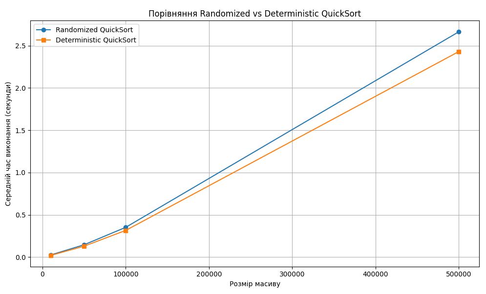

# Comparison of Randomized and Deterministic QuickSort

Randomized and deterministic QuickSort are tested on arrays of different sizes: 10,000, 50,000, 100,000, and 500,000 elements. Each test is run 5 times, the average result is displayed, and a plot is generated.

- Deterministic QuickSort always chooses the pivot element based on a fixed rule (e.g., the first or last element). This allows for better predictability in partitioning the array and optimizing caching.

- Randomized QuickSort selects the pivot randomly. This results in additional random.randint() calls which, though minor, add to the total runtime.

### Results

- Deterministic QuickSort was on average 10% faster than the randomized version, which became more noticeable on larger arrays.

        Array size: 500000
            Randomized  QuickSort: 2.5584 секунд
            Deterministic  QuickSort: 2.3366 секунд

    

- Deterministic QuickSort also showed more stable results. Sorting variation on a 500,000-element array was ~3%, compared to ~20% for the randomized version.

        Randomized QuickSort:
            2.4671195999981137
            3.0014023999974597
            2.474212200002512
            2.481281599990325
            2.5992803999979515
                Average: 2.6047 seconds
        Deterministic  QuickSort:
            2.2803584999928717
            2.3411029999988386
            2.318496000007144
            2.2443629000044893
            2.27304169999843
            Average: 2.2915 seconds

### Possible reasons:
- If the pivot is selected as the first element, memory access is simplified, resulting in lower CPU cache load.
- Random function calls take some time, and at scale this becomes noticeable.
- Deterministic code structures are often better optimized by the compiler or interpreter.

### 📌 Conclusion:
- On average, both algorithms have the same asymptotic complexity — O(n log n).
- Deterministic QuickSort may be slightly faster in practice on random data due to:
  - better memory locality,
  - lower overhead (no random calls),
  - simpler implementation without random number generation.

---

# 2 Class Schedule Generation Using a Greedy Algorithm
This project implements a simple algorithm to generate an optimal schedule for teachers based on the subjects to be taught and each teacher’s skill set.

### 🔧 How it works
- Teachers are defined using a Teacher class. Each teacher has: first name, last name, age, email, a set of subjects they can teach, and a set of assigned subjects.
- A greedy algorithm assigns teachers in an attempt to cover all required subjects.
  - It selects the teacher who covers the most uncovered subjects.
  - In case of a tie, the youngest teacher is preferred.
- If it is not possible to cover all subjects with the available teachers, a message is printed.
